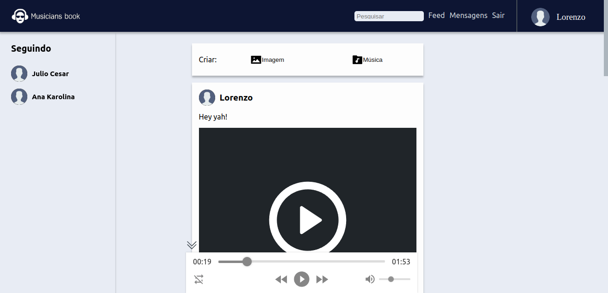
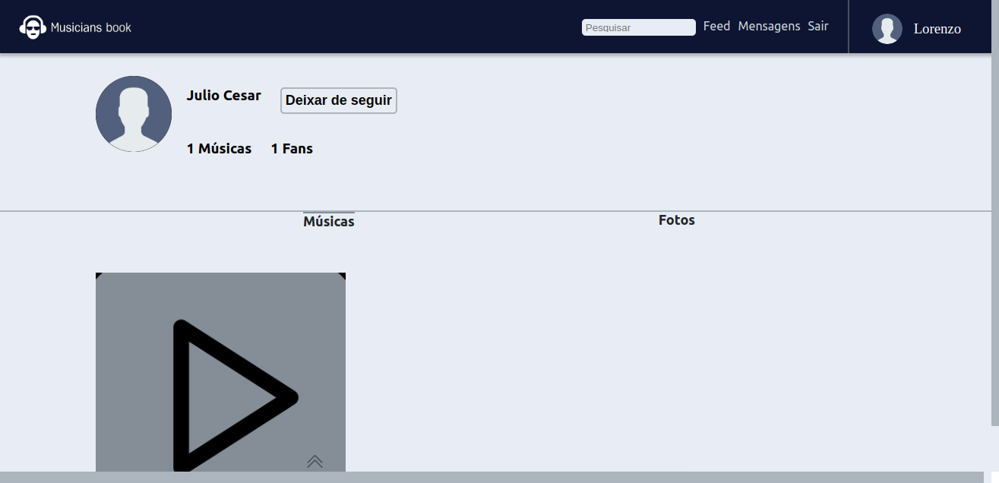
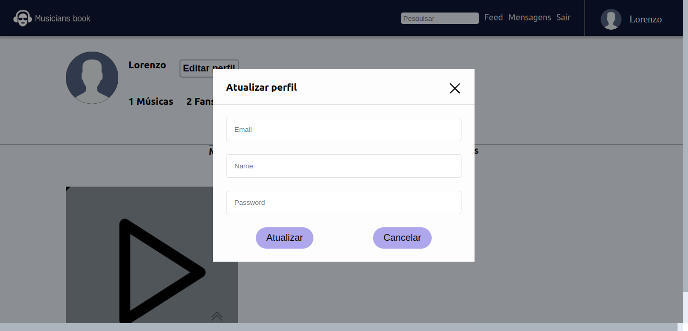
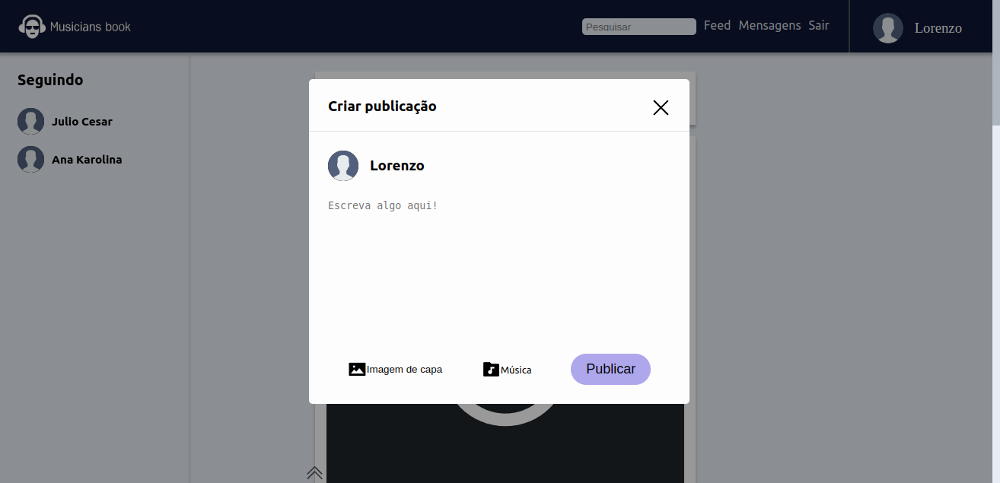
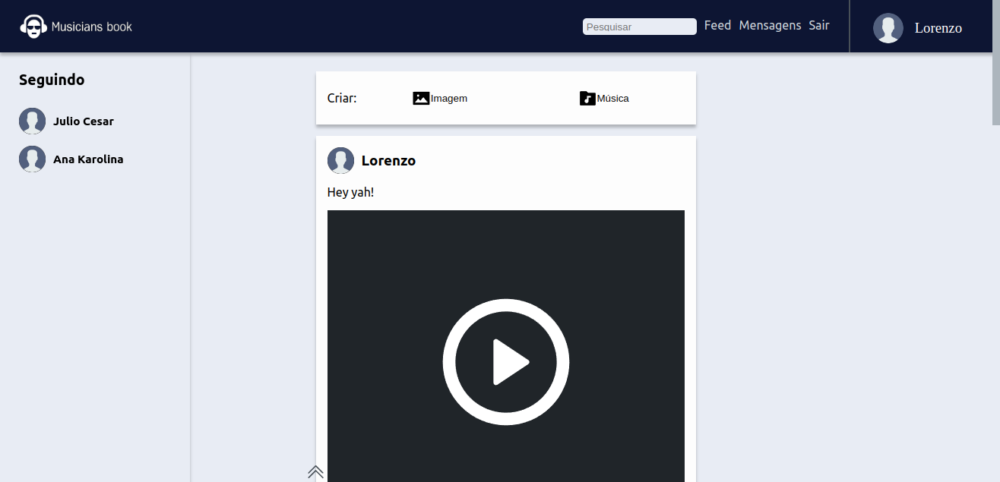
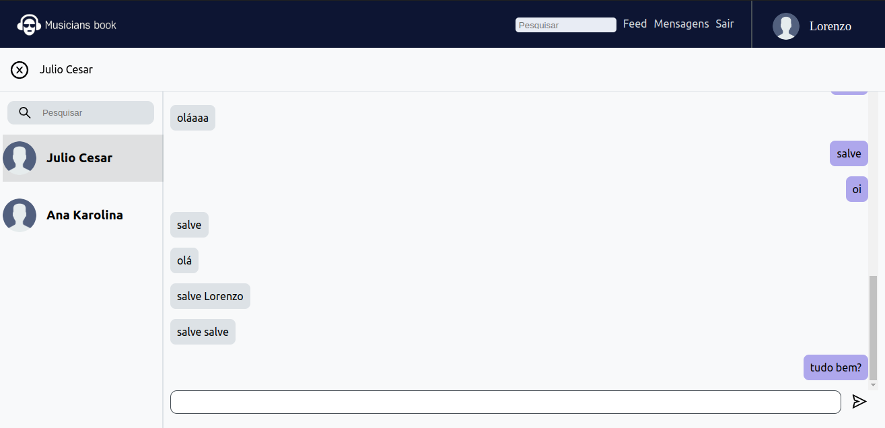

<header>
        <h1>MusiciansBook</h1>
</header>

<section>
        <h2>Funcionalidades</h2>
        <ul>
            <li>Cadastro e login de usuários</li>
            <li>Criação de perfil para músicos e amantes da música</li>
            <li>Upload de músicas e fotos</li>
            <li>Feed de notícias com atualizações de músicos seguidos e músicas recentemente adicionadas</li>
            <li>Chat em tempo real entre músicos e amantes da música</li>
        </ul>
</section>

<section>
  <h2>Imagens da Aplicação</h2>
  
  

    
    
  

  

    
    
  

  

    
    
  

  

    
    
  

</section>

<section>
    <h2>Como acessar a aplicação</h2>
    <a href="https://musicians-book.vercel.app/">Acesse a aplicação clicando aqui!</a>
</section>

<section>
    <h2>Equipe</h2>
    <ul>
        <li>Lorenzo Marques - Desenvolvedor Full-Stack</li>
     </ul>
</section>

<section>
    <h2>Tecnologias utilizadas</h2>
    <ul>
        <li>Reactjs</li>
        <li>Styled-Components</li>
        <li>JavaScript</li>
        <li>Redux</li>
        <li>Axios</li>
        <li>WebSockets</li>
        <li>jsonwebtoken</li>
    </ul>
</section>

<h2>Back-end da aplicação</h2>

<section>
    <a href="https://github.com/LorenzoMarques/musiciansbook-api">Acesse o repositório contendo o back-end da aplicação clicando aqui!</a>
</section>

<footer>
    
Desenvolvido por Lorenzo Marques © 2023

</footer>
